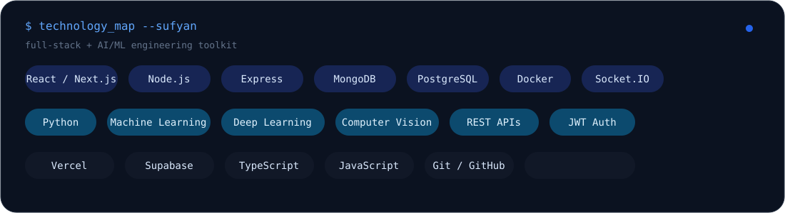
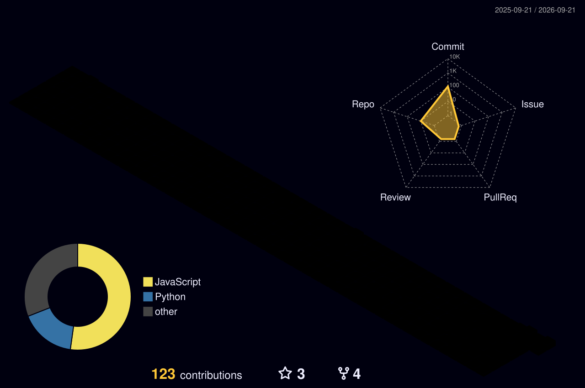
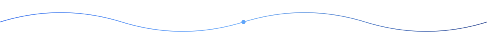

<div align="center">

<a href="https://github.com/sufyankhan2412">

</a>

<br/>

<p>
<strong>Full-Stack Developer</strong> &nbsp;×&nbsp;
<strong>AI/ML Engineer</strong>
</p>

<p>
Building scalable web applications and intelligent systems.
</p>

<a href="https://github.com/sufyankhan2412">

</a>
&nbsp;
<a href="https://github.com/sufyankhan2412?tab=followers">

</a>

</div>

---

## `whoami`

```javascript
const sufyan = {
  role: "Full-Stack Developer",
  focus: ["AI/ML", "Deep Learning", "Web Engineering"],
  education: "Computer Science — COMSATS University Islamabad",

  frontend: ["React", "Next.js", "Vite", "Tailwind CSS", "Framer Motion", "Zustand"],
  backend: ["Node.js", "Express.js", "REST APIs", "Socket.IO"],
  databases: ["MongoDB", "PostgreSQL", "Supabase"],
  ai_ml: ["Python", "Machine Learning", "Deep Learning", "Computer Vision"],
  infrastructure: ["Docker", "Vercel", "Render", "GitHub"]
};
```

## `about`

I am a **Full-Stack Developer** focused on building modern web applications and exploring **Artificial Intelligence and Machine Learning**.

I enjoy taking a product from **interface → API → database → real-time systems → deployment → AI integration**.

My direction sits at the intersection of:

**Full-Stack Engineering × Artificial Intelligence × Machine Learning**

---

## `featured work`

<table>
<tr>
<td width="50%" valign="top">

### AI-Assisted Urban Planning

My final-year project focused on an **AI-assisted 2D urban planning and society map generator**.

**Focus:** AI · Computer Vision · Automation · Web Engineering

</td>
<td width="50%" valign="top">

### Car Rental Marketplace

A full-stack marketplace for discovering and renting vehicles.

**Stack:** MERN · REST APIs · Authentication · MongoDB

</td>
</tr>

<tr>
<td width="50%" valign="top">

### Real-Time Chat

A WhatsApp-inspired real-time communication system.

**Stack:** React · Node.js · MongoDB · Socket.IO · JWT

**Features:** messaging · presence · typing · read receipts · editing · deletion · voice · media

</td>
<td width="50%" valign="top">

### Food Recognition

A computer-vision project for recognizing food from images and working toward calorie estimation.

**Focus:** Python · Machine Learning · Computer Vision

</td>
</tr>
</table>

---

## `technology map`

<p align="center">

</p>

---

## `engineering toolkit`

```text
Frontend       → React.js / Next.js / Vite / Tailwind CSS / Framer Motion / Zustand
Backend        → Node.js / Express.js / REST APIs
Real-Time      → Socket.IO / WebSockets
Database       → MongoDB / PostgreSQL / Supabase
Authentication → JWT
AI / ML        → Python / Machine Learning / Deep Learning / Computer Vision
Deployment     → Vercel / Render / Docker
Workflow       → Git / GitHub / Agile
```

---

## `contribution animation`

<p align="center">
<picture>
  <source media="(prefers-color-scheme: dark)" srcset="./github-snake-dark.svg">
  <source media="(prefers-color-scheme: light)" srcset="./github-snake.svg">
  
</picture>
</p>

---

## `3D contribution activity`

<p align="center">

</p>

---

## `research direction`

I am interested in:

**AI Safety · AI Cybersecurity · Machine Learning · Deep Learning · Computer Vision**

My goal is to combine strong software-engineering fundamentals with practical AI experimentation, research, and eventually publication.

---

## `currently exploring`

```text
[01] AI Safety
[02] Deep Learning
[03] Computer Vision
[04] AI Cybersecurity
[05] LLM Applications
[06] Scalable Backend Architecture
[07] System Design
[08] AI Research
```

---

## `development philosophy`

> **Build things that work.**
>
> **Understand how they work.**
>
> **Improve how they scale.**
>
> **Research how they can become better.**

---

## `connect`

<p align="center">

<a href="https://github.com/sufyankhan2412">

</a>

<a href="https://www.linkedin.com/in/sufyan-khan-3683bb291">

</a>

<a href="https://portfolio-orcin-six-34.vercel.app/#get-in-touch">

</a>

<a href="mailto:sufyanmk2024801@gmail.com">

</a>

</p>

<div align="center">

**Open to software engineering, AI/ML, and research opportunities.**



</div>
